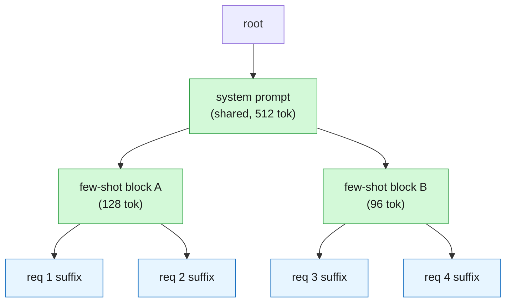

Most of the throughput story in LLM serving is told as a memory story: PagedAttention <d-cite key="kwon2023vllm"></d-cite> made KV cache allocation look like virtual memory, and everyone moved on. SGLang <d-cite key="zheng2024sglang"></d-cite> makes a different and, to me, more interesting claim — that once KV state is _shareable_ across requests, **the order in which you admit requests is itself a cache-replacement decision**. Scheduling stops being a fairness/latency knob and becomes a hit-rate knob. This post is my read of the two mechanisms that carry that claim: radix-tree prefix sharing with DFS-ordered scheduling, and jump-forward decoding for constrained output.

## The setup — KV reuse is a tree, not a cache line

The observation underneath RadixAttention is that in real workloads, requests are not independent strings — they share prefixes. A few-shot prompt, a system prompt, a chat history, a tree-of-thought expansion, a batch of RL rollouts sampled from the same state: all of these are _many requests that agree on a long prefix and diverge at some suffix_. And since attention is causal, the KV entries for a prefix depend only on that prefix. So if two requests share the first $$k$$ tokens, they can share the first $$k$$ KV blocks — not "recompute cheaply," but literally point at the same memory.

The right index structure for "set of strings with shared prefixes" is a radix tree, and that is exactly what SGLang keeps: nodes are token sequences, edges extend a prefix, and each node owns the KV blocks for its segment. A new request walks the tree from the root, matching as far as it can, and the length of that walk is the number of prefill tokens it _doesn't_ have to compute. Eviction is LRU over the leaves, with reference counting so that a node still in use by a running request can't be reclaimed:

```cpp
struct RadixNode {
    std::vector<TokenId> segment;                  // this node's token run
    std::vector<BlockId> kv_blocks;                // KV pages for `segment`
    std::unordered_map<TokenId, RadixNode*> kids;  // keyed by first token of the child
    RadixNode* parent = nullptr;

    int  ref_count = 0;   // running requests pinning this node; >0 blocks eviction
    Tick last_access = 0; // LRU key — only meaningful on leaves with ref_count == 0
};
```

The `ref_count`/`last_access` pair is the whole memory policy in two fields: you may only evict a _leaf_ whose refcount is zero, which is what keeps a shared prefix alive as long as anyone below it is still generating.



The metric that matters is the fraction of prompt tokens served out of the tree rather than recomputed. For a batch of requests $$r_1, \dots, r_n$$ hitting a tree state $$\mathcal{T}$$:

$$
\text{hit rate} \;=\; \frac{\sum_{i=1}^{n} \bigl| \mathrm{lcp}(r_i, \mathcal{T}) \bigr|}{\sum_{i=1}^{n} |r_i|}
$$

where $$\mathrm{lcp}(r_i, \mathcal{T})$$ is the longest prefix of $$r_i$$ present in the tree _at the moment $$r_i$$ is scheduled_. That last clause is the whole point, and it is where scheduling walks in.

## DFS ordering, or why the schedule is the cache policy

Read the hit-rate expression again: $$\mathcal{T}$$ is not a constant. It's the tree _as it exists when the request runs_, and what's in it depends on which requests ran before, and what got evicted in between. So the scheduler is choosing the denominator's fate. Run all the requests that share a subtree back-to-back and the subtree is hot for all of them; interleave them with unrelated requests and the LRU policy evicts the subtree between visits — you pay for the same prefix two or three times.

SGLang's policy is to sort the waiting queue by **longest matched prefix**: whichever request has the deepest match against the current tree goes first. The paper's framing is that this ordering is, up to ties, a **depth-first traversal of the radix tree**. That's the part I find genuinely nice, because it converts a scheduling heuristic into a statement you can reason about: a DFS visits every node in a subtree contiguously, so each shared prefix is computed once, kept resident while its entire subtree is drained, and then evicted for good. There is no revisit, so — provided the cache is large enough to hold the KV of one root-to-leaf path — the _only_ prefill tokens you compute are the ones that were genuinely new. That's the optimum for this request set.<d-footnote>The "large enough" caveat is doing real work. If the cache can't hold a full path, the subtree gets evicted mid-traversal and you're back to recomputation — DFS-optimality degrades gracefully, but it degrades. This is exactly the regime where the interaction with continuous batching gets interesting, since the running batch is also eating KV blocks.</d-footnote>

The cost is the obvious one: **longest-prefix-first is not fair**. A request whose prefix nobody shares can sit behind an unbounded stream of requests that keep matching deeper into a hot subtree — classic starvation, and the more cache-friendly your workload, the worse it gets. Production SGLang doesn't run pure LPM for this reason; the scheduler bounds the reordering (waiting-queue window, FCFS fallback, aging) so that cache-affinity is a _preference_ inside a bounded window rather than a total order. Sketching the policy as code makes the tension obvious:

<d-code block language="python">
def next_batch(waiting, tree, budget, max_reorder_window):
    # Cache affinity is only allowed to reorder within a bounded window,
    # otherwise a hot subtree can starve a prefix-less request forever.
    window = waiting[:max_reorder_window]
    scored = sorted(
        window,
        key=lambda r: -tree.longest_matched_prefix(r.tokens),  # DFS-ish order
    )

    batch, used = [], 0
    for req in scored:
        matched = tree.longest_matched_prefix(req.tokens)
        need = kv_blocks_for(len(req.tokens) - matched)  # only the *new* tokens
        if used + need > budget:
            break
        tree.pin(req, matched)   # refcount++, so LRU can't evict it mid-flight
        batch.append(req)
        used += need
    return batch

</d-code>

The line I keep staring at is `need = kv_blocks_for(len(req.tokens) - matched)`. Under prefix sharing, a request's admission cost depends on _what else has already run_ — which means the scheduler's cost model is stateful, and greedy packing against a KV budget is no longer separable per request. That's a different animal from the vLLM-style scheduler, where a request's block demand is a property of the request alone.

## Jump-forward decoding

The second mechanism is orthogonal and targets constrained decoding. When output is constrained by a grammar or regex — JSON matching a schema, say — SGLang compiles the constraint into a finite-state machine and, at each step, masks the logits to the transitions the FSM allows. The standard implementation still runs one forward pass per token, even when the FSM permits exactly one continuation.

But look at what a JSON schema actually looks like as an FSM. After the model commits to emitting an object with a `name` field, the path through `{"name":` is _deterministic_ — there is a run of states with exactly one outgoing transition. Those tokens are not predictions; they are structure. Running a 70B forward pass to "decide" the `"` after `{` is pure waste. Jump-forward decoding detects these deterministic runs in the FSM and emits the whole run at once, appending it to the KV cache via a prefill-style batched pass instead of $$m$$ sequential decode steps. On schema-heavy workloads the win is large, because the deterministic runs are a big fraction of the output.

The subtlety — and the reason this isn't a five-line patch — is **retokenization**. The FSM is defined over characters; the model consumes tokens. If you jump forward over the string `":` and then hand the model a token boundary it would never have produced itself, you've pushed it off-distribution: the tokenizer might merge `":` with the following character into a single token, and now the model's context contains a token sequence that no tokenizer would ever emit for that text. SGLang handles this by re-tokenizing the jumped span together with its boundary context, rather than naively concatenating token IDs.

## What I still want to measure

Two things I don't yet have a good intuition for, and want to poke at in my own [mini engine]({{ '/projects/mini-inference-engine/' | relative_url }}):

1. **How DFS ordering interacts with continuous batching under memory pressure.** The DFS-optimality argument assumes a path fits in cache. But the running batch is simultaneously consuming KV blocks, so the effective cache for the _waiting_ queue is whatever decode isn't using — a quantity that moves every step. I'd like to know how quickly the hit-rate advantage collapses as that headroom shrinks.

2. **Whether prefix-affinity scheduling helps or hurts RL rollout.** Rollouts from a shared state are the ideal radix workload — enormous shared prefix, $$n$$ divergent suffixes. But in RL you also want to _cancel_ or deprioritize some of those rollouts, and cancelling a request that's pinning a shared subtree is not free. That's the seam between this post and the [rollout scheduler]({{ '/projects/rl-rollout-scheduler/' | relative_url }}) I'm building — the admission decision and the cache decision are the same decision, and I don't think anyone has written down what the joint policy should be.
